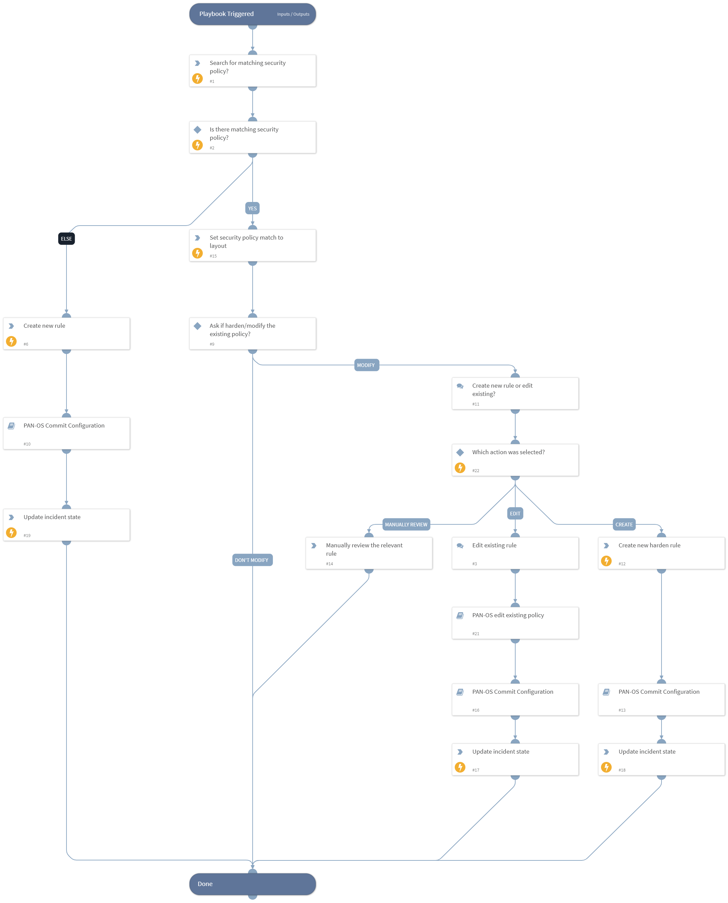

This playbook will automate the process of creating or editing a policy.
The first task in the playbook checks whether there is a security policy that matches the playbook inputs. If there is no security policy that matches, a new policy will be created. If there is a security policy that matches, the user will be able to modify the existing policy or create a new hardened policy. 

## Dependencies
This playbook uses the following sub-playbooks, integrations, and scripts.

### Sub-playbooks
* PAN-OS Commit Configuration
* PAN-OS edit policy

### Integrations
This playbook does not use any integrations.

### Scripts
* PanoramaSecurityPolicyMatchWrapper
* SetGridField

### Commands
* setIncident
* pan-os-create-rule

## Playbook Inputs
---

| **Name** | **Description** | **Default Value** | **Required** |
| --- | --- | --- | --- |
| Destination | Destination. | incident.destinationips | Optional |
| Source | Source. | incident.sourceips | Optional |
| Protocol  | The IP protocol number | incident.protocol | Optional |
| Action | Action for the rule \(allow, deny, drop\) | incident.policyactions | Optional |
| Application  | A comma-separated list of application object names for the rule to create. |  | Optional |
| Destination_zone | A comma-separated list of destination zones. | incident.destinationnetworks | Optional |
| Log_forwarding | Log forwarding profile. |  | Optional |
| Profile_setting | A profile setting group. |  | Optional |
| Rulename | Name of the rule to create. |  | Optional |
| Service | A comma-separated list of service object names for the rule. | incident.policyactions | Optional |
| Source_zone | A comma-separated list of source zones. | incident.sourcenetworks | Optional |
| Email | The email of the network/security team.   |  | Optional |
| Rule_position | Pre rule or Post rule \(Panorama instances\). Possible options: - post-rulebase - pre-rulebase |  | Optional |
| Destination_port | Destination port. | incident.dstports | Optional |
| Target | Target number of the firewall. Use only for a Panorama instance. |  | Optional |
| Vsys | Target vsys of the firewall. Use only for a Panorama instance. |  | Optional |
| Limit | Maximum number of API requests that the  PanoramaSecurityPolicyMatchWrapper script will send. The default is 500. |  | Optional |

## Playbook Outputs
---
There are no outputs for this playbook.

## Playbook Image
---

