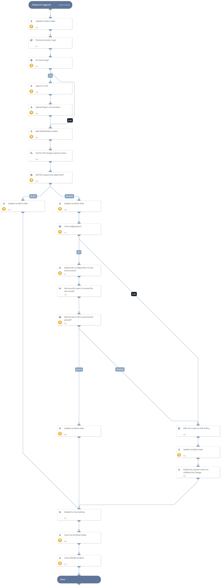

If you are using a PAN-OS/Panorama firewall and ServiceNow as a ticketing system this playbook is a perfect match for your change management for firewall process.
This playbook is triggered by a fetch from ServiceNow and helps you manage and automate your change management process.     

## Dependencies
This playbook uses the following sub-playbooks, integrations, and scripts.

### Sub-playbooks
* PAN-OS create or edit policy
* Panorama Query Logs

### Integrations
This playbook does not use any integrations.

### Scripts
ExportToCSV

### Commands
* servicenow-update-ticket
* setIncident
* servicenow-upload-file
* pan-os-create-rule
* servicenow-add-link
* closeInvestigation

## Playbook Inputs
---

| **Name** | **Description** | **Default Value** | **Required** |
| --- | --- | --- | --- |
| TicketSummary | Provide a summary for your firewall request.  | incident.details | Optional |
| SecurityTeamEmail | The email of the security team that approves the firewall requests.  |  | Optional |
| log_type | Log type to query. Can be: traffic, threat, wildfire, url or data-filtering. | traffic | Optional |
| query | The query string by which to match criteria for the logs. This is similar to the query provided in the web interface under the Monitor tab when viewing the logs. |  | Optional |
| addr-src | Source address. | incident.sourceips | Optional |
| addr-dst | Destination address. | incident.destinationips | Optional |
| port-dst | Destination port. | incident.dstports | Optional |
| TestConfigurations | By providing YES to this input the requested firewall rule will be tested in your test environment.  | No | Optional |
| zone-src | Firewall source zone. | incident.sourcenetworks | Optional |
| zone-dst | Firewall destination zone. | incident.destinationnetworks | Optional |
| TestInstance | The instance name of the firewall in the DEV environment for testing the new rule. |  | Optional |
| Action | The action for the change request | incident.policyactions | Optional |
| Protocol | The IP protocol. | incident.protocol | Optional |
| Log_forwarding | Log forwarding profile. |  | Optional |
| Profile_setting | A profile setting group. |  | Optional |
| Service | A comma-separated list of service object names for the rule. | incident.protocolnames | Optional |
| Application | A comma-separated list of application object names for the rule to create. |  | Optional |
| Rulename | Name of the rule to create. |  | Optional |
| Description | The description of the ticket. | incident.description | Optional |
| Time-generated | The time the log was generated from the timestamp and prior to it. For example: "2019/08/11 01:10:44". |  | Optional |
| Rule_position | Pre rule or Post rule \(Panorama instances\). Possible options: - post-rulebase - pre-rulebase |  | Optional |
| Target | Target number of the firewall. Use only for a Panorama instance. |  | Optional |
| Vsys | Target number of the firewall. Use only for a Panorama instance. |  | Optional |
| Limit | Maximum number of API requests that the  PanoramaSecurityPolicyMatchWrapper script will send. The default is 500. |  | Optional |

## Playbook Outputs
---
There are no outputs for this playbook.

## Playbook Image
---

