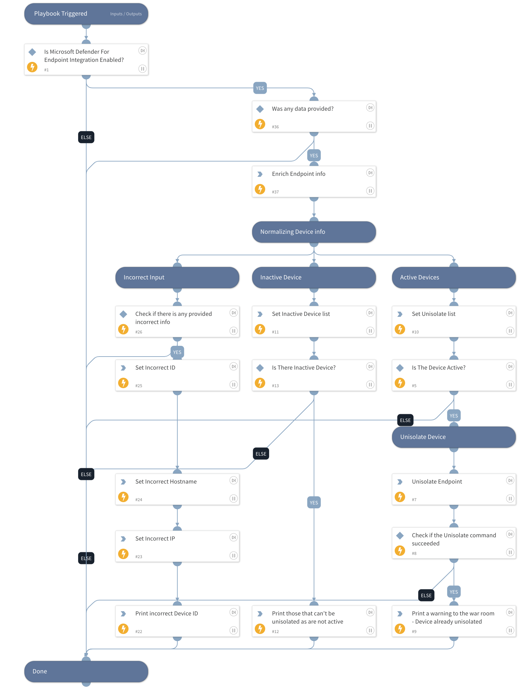

This playbook will auto un-isolate endpoints by the *device ID that was provided in the playbook.

*Hostname is not recognized as a device ID. 
For more information, you can use the following commands:
!microsoft-atp-get-machine-details
!microsoft-atp-get-machines

## Dependencies
This playbook uses the following sub-playbooks, integrations, and scripts.

### Sub-playbooks
This playbook does not use any sub-playbooks.

### Integrations
* MicrosoftDefenderAdvancedThreatProtection

### Scripts
* SetAndHandleEmpty
* isError
* Print
* IsIntegrationAvailable

### Commands
* microsoft-atp-unisolate-machine
* microsoft-atp-get-machine-details

## Playbook Inputs
---

| **Name** | **Description** | **Default Value** | **Required** |
| --- | --- | --- | --- |
| Device_id | The device ID to isolate. For more information, you can use the following commands: \!microsoft-atp-get-machine-details \!microsoft-atp-get-machines |  | Optional |

## Playbook Outputs
---

| **Path** | **Description** | **Type** |
| --- | --- | --- |
| MicrosoftATP.MachineAction.ID | The machine action ID. | unknown |
| MicrosoftATP.NonUnisolateList | Those machine IDs that won't be released from isolation | unknown |
| MicrosoftATP.UnisolateList | Machine IDs that were released from isolation. | unknown |

## Playbook Image
---
